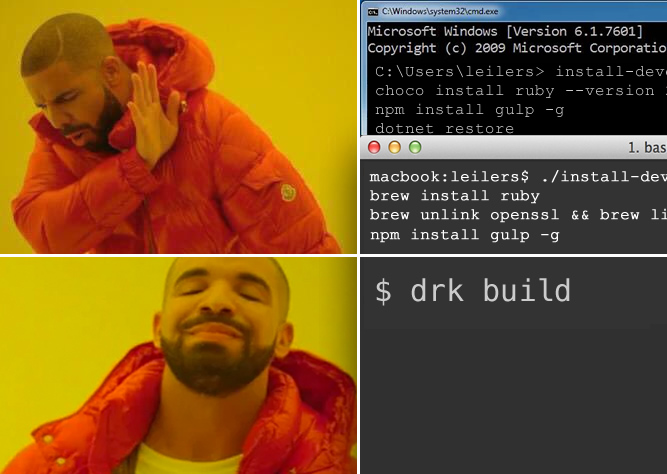

# Drake : Docker make



Drake is a cross-platform command-line build tool that executes build commands in a docker container, so that you can encapsulate all your build dependencies. Regardless of what platform you're using for development, your build commands will run in a single linux environment- the same environment you use in your CI pipeline.

If you like using Docker in Jenkins pipelines, think of Drake as a develoment-time CLI version of  `docker.image("someimage") { some build commands }` in your Jenkinsfile.

# How does it work?
Drake builds a Docker image from your specified build-time Dockerfile, launches the container with your repository root mounted in the container's file system, and passes the shell command and environment variables you specify via docker run. You use a simple yaml configuration file to map host commands to container commands.

At its core, Drake is just a simpler interface for issuing the following docker commands:

```bash
docker build . -t foobarbuildimage --file ./Dockerfile.build
docker run -w /code -e SOME_ENV -v /repos/foobar:/code foobarbuildimage /bin/sh -c ./some-build-command.sh
```

# Example
Imagine I'm building a dotnet core application, and I'm using node/gulp to build static files. I also have a shell script to deploy.

First, create a configuration file: `drk.yaml`:

```yaml
dockerFile: Dockerfile.build
dockerDir: /code
commands:
  default: 
    command: dotnet
  deploy:
    command: ./deploy.sh
  static:
    command: gulp
```

Then, create a `Dockerfile.build` that contains your build dependencies:

```dockerfile
FROM microsoft/dotnet:sdk

# Install nodejs
RUN curl -sL https://deb.nodesource.com/setup_10.x | bash -
RUN apt-get install -y nodejs

# Install gulp
RUN npm install gulp -g
```

Then, you can use these same build commands from Windows, Mac, or Linux:

```bash
# Runs "dotnet build" inside the docker container
# The default command is "dotnet", and any command that isn't specifically defined gets appended to "dotnet".
$ drk build

# Runs "gulp"
$ drk static

# Runs ./deploy.sh --credential=12345
$ drk deploy --credential=12345
```

## Installation
Since Drake is a build tool, I made installation possible with a one-liner:

### Windows

Run this in powershell:

```powershell
Set-ExecutionPolicy Bypass -Scope Process -Force; iex ((New-Object System.Net.WebClient).DownloadString('https://raw.githubusercontent.com/labaneilers/drake/master/Install.ps1'))
```

### MacOS and Linux

Run this in bash:

```shell
wget -O - https://raw.githubusercontent.com/labaneilers/drake/master/install.sh | bash
```

## Why

I created Drake for a few reasons:

* My work offers developers a lot of autonomy, so team members inevitably end up choose different development platforms from one another. Teams also have the freedom to choose the right app stack for the problems they're working on. This is awesome, but it makes it a pain to write build/deployment scripts that work for everyone.
* Using Docker build containers with Jenkins pipelines is *amazing*. Being able to define your dependencies in a Jenkinsfile and keep it in source control solves so many problems. Unfortunately, there's no great story for using the Jenkinsfile pipeline steps in the Jenkinsfile in a developer environment- certainly not cross-platform.
* Many build systems run cross-platform, but they require writing plugins to integrate any new task (to preserve platform independence). This is a lot more complicated than simply using the flexibility of the unix shell.
* The docker and docker-compose tooling are super powerful, and can already do all this, but the ergonomics aren't great for this use case.

## Patterns

Here's the pattern I think would work well with Drake:

* Choose your favorite linux-compatible build system (rake, gulp, cake, bash scripts, etc) and implement your build scripts with that.
* Create a `Dockerfile.build` file that can be shared between Drake and Jenkins.
* Create a `drk.yaml` file with a default command that invokes your build system. This should be as thin a wrapper as possible on top of your build system's configuration.
* Create a `Jenkinsfile` and define a pipeline that also points to the build system. Similarly to the `drk.yaml` file, this should be as thin a wrapper as possible on top of the build system's commands, and only really contain the plumbing for Jenkins (i.e. passing credentials, etc).

## drk.yaml

Here's the simplest possible `drk.yaml`:

```yaml
commands:
  default: 
    command: rake
```

Running `drk build` would build an image based on `Dockerfile.build`, mount the current directory in `/code`, and run `rake build` in the container.

Here's a configuration that uses `npm` as the build system, and has a separate Dockerfile just for debug configuration:

```yaml
commands:
  default: 
    command: npm run
  default: 
    command: nodemon --legacy-watch --watch ./ --inspect=0.0.0.0:9222 --nolazy ./server.js
    dockerFile: Dockerfile.debug
    ports:
      - "56789:80"
      - "9222:9222"
```

Here's a config for an app that uses `cake` to build a dotnet app, and passes AWS credentials to a release script written for `bash`:

```yaml
commands: 
  default: 
    command: cake
  release:
    command: ./release.sh
    env: # Pass through credentials
      - AWS_ACCESS_KEY_ID
      - AWS_SECRET_ACCESS_KEY
```

Here's a config for a `go` project:

```yaml
dockerDir: /go/src/drake # The directory inside the container to mount the repo in
commands:
  default: 
    command: go
    env:
      - GOPATH=/go # Set GOPATH
```

